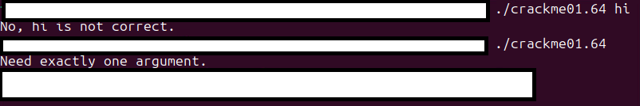
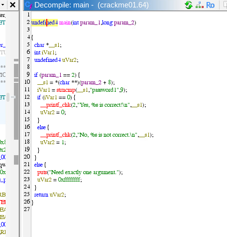
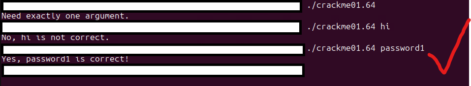

# Crackme solutions

## Crack1

Running the program we see it needs one user provided argument.



Upon throwing the program into Ghidra and clicking on the main function in the functions section of the Symbol Tree, we see the assembly along with the high-level code generated by Ghidra.


We can see the flag already, but we can clean it up anyway to make it more readable. Editing the signature of the function goes a long way in making it more readable.


We can see clearly the flag is ```password1``` in the code. Running the program with password1 as an argument works successfully.



## Notes

To work with them, run `make <name>` where `<name>` is one of `crackme01`, `crackme02`, etc. Figure out how to make the crackme exit with the status code 0.
Crack w/o looking at the source code
