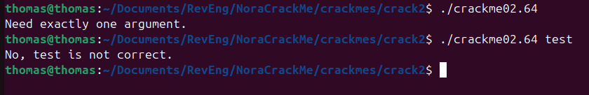
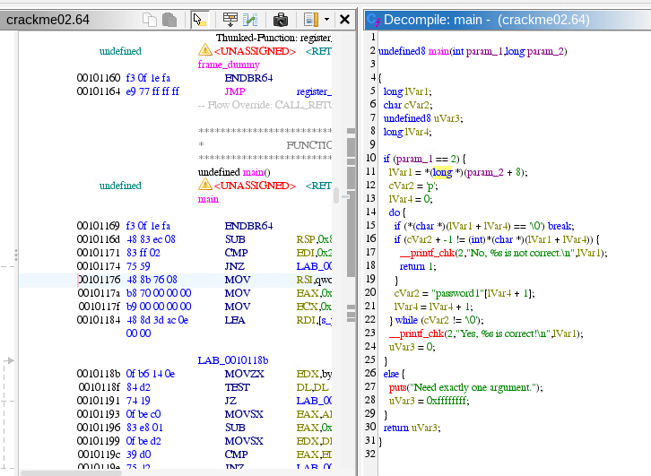
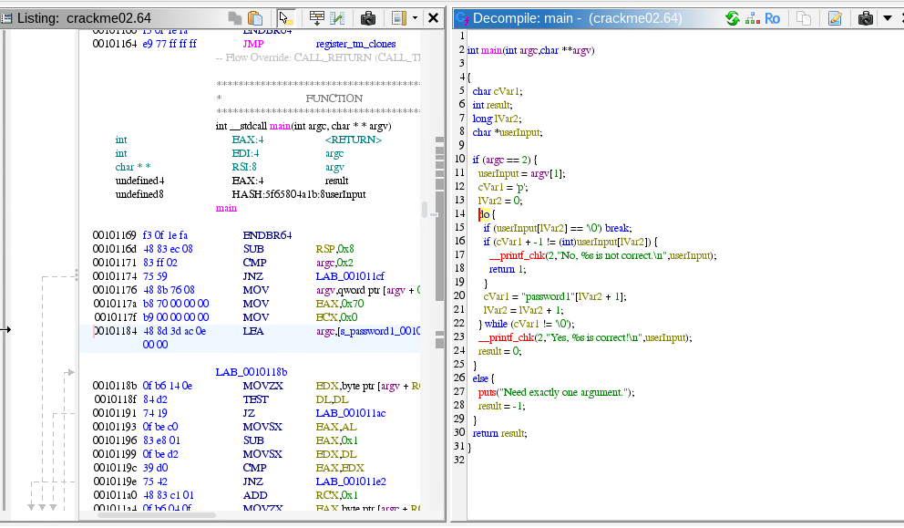
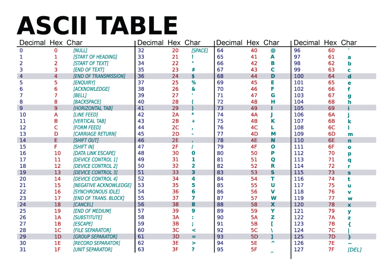
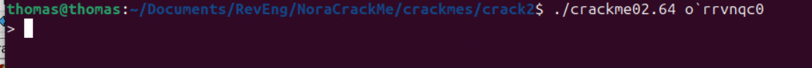
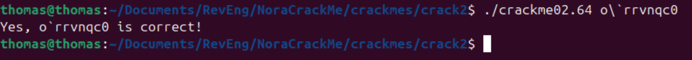

# Crackme solutions

## Crack1

Running the program we see it needs one user provided argument.


Upon throwing the program into Ghidra and clicking on the main function in the functions section of the Symbol Tree, we see the assembly along with the high-level code generated by Ghidra.


We can see the flag already, but we can clean it up anyway to make it more readable. Editing the signature of the function goes a long way in making it more readable.


We can see clearly the flag is ```password1``` in the code. Running the program with password1 as an argument works successfully.


## Crack2

Running the program we see it needs one user provided argument.



Throwing the program into Ghidra and clicking on the main function in the functions section of the Symbol Tree, we see the assembly along with the high-level code generated by Ghidra.



Cleaning up the decompiled high-level code generated by Ghidra does little to make it more readable; however, it is still possible to decipher what exactly this program does.

It iterates through the user's argument character by character confirming each character of the user's argument is equal to the ascii value of corresponding index of the refernce password, but -1.

Alteranitvely, the user can input "" to get the program to exit successfully.



Refering to an ascii chart is required to derive the password:




There are two ways to get the program to execute sucessfully:
  1. Run the program with the empty string
  2. Run the program with "password1", but make all the ascii values one less (p's ascii value 112, user's argument should have ascii value of 111 o)

     p becomes o, a becomes `, s becomes r, w becoms v, o becomes n, r becomes g, d becomes c, and 1 becomes 0

     password: o'rrvngc0

We can now verify the flag:




The above does not work for some reason... It is an issue with my terminal. It does not like the ` character.

To fix, insert the \ character before the ` character.



To obtain the answer step-by-step via the assembly, refer to crack2/images/assemb.pdf.

## Notes

To work with them, run `make <name>` where `<name>` is one of `crackme01`, `crackme02`, etc. Figure out how to make the crackme exit with the status code 0.
Crack w/o looking at the source code
